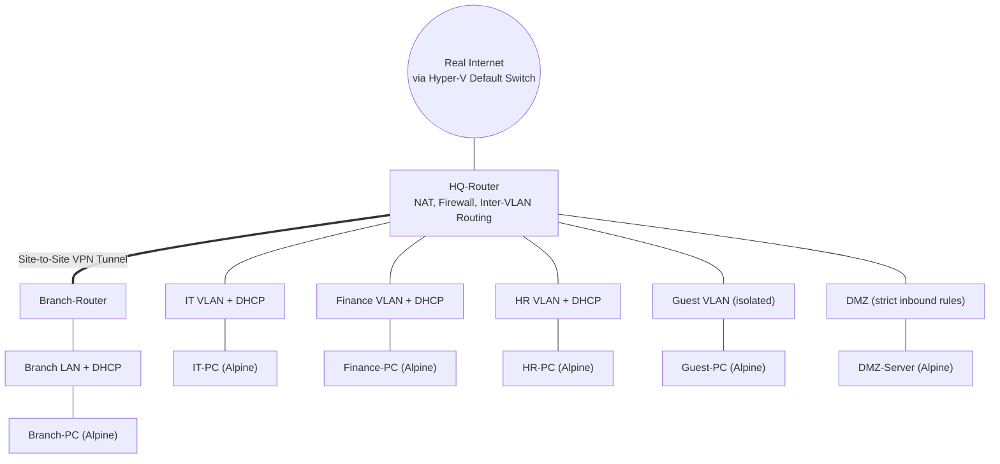
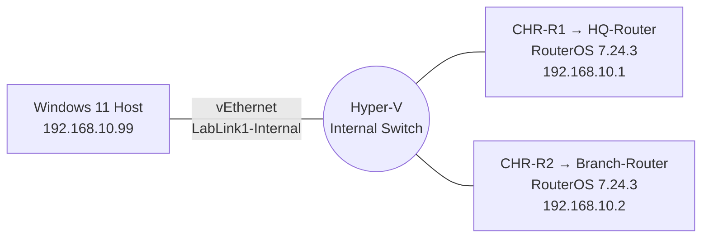
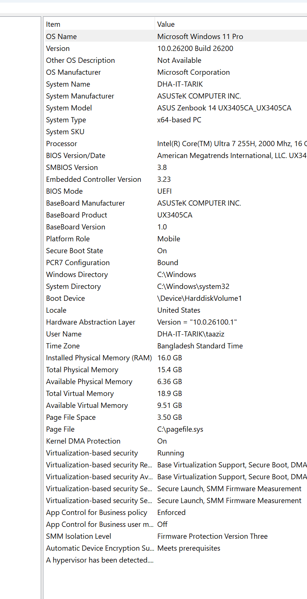
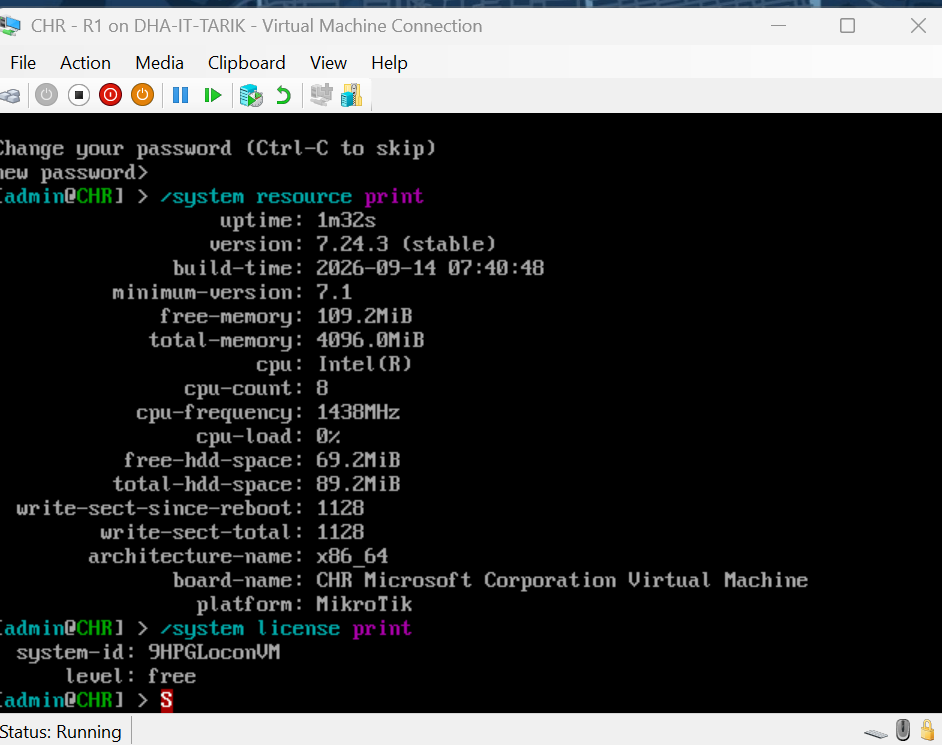
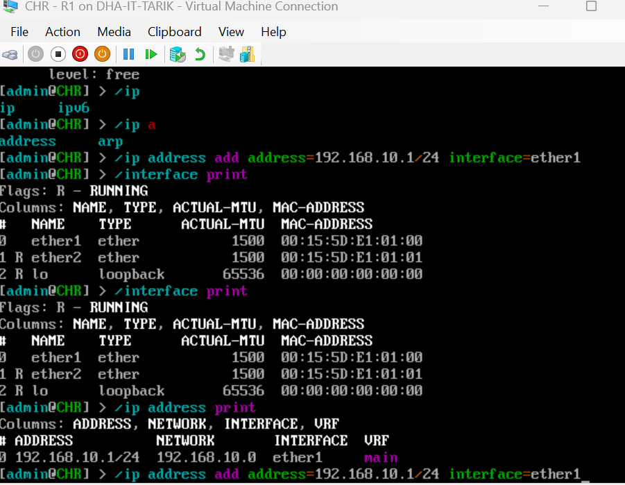
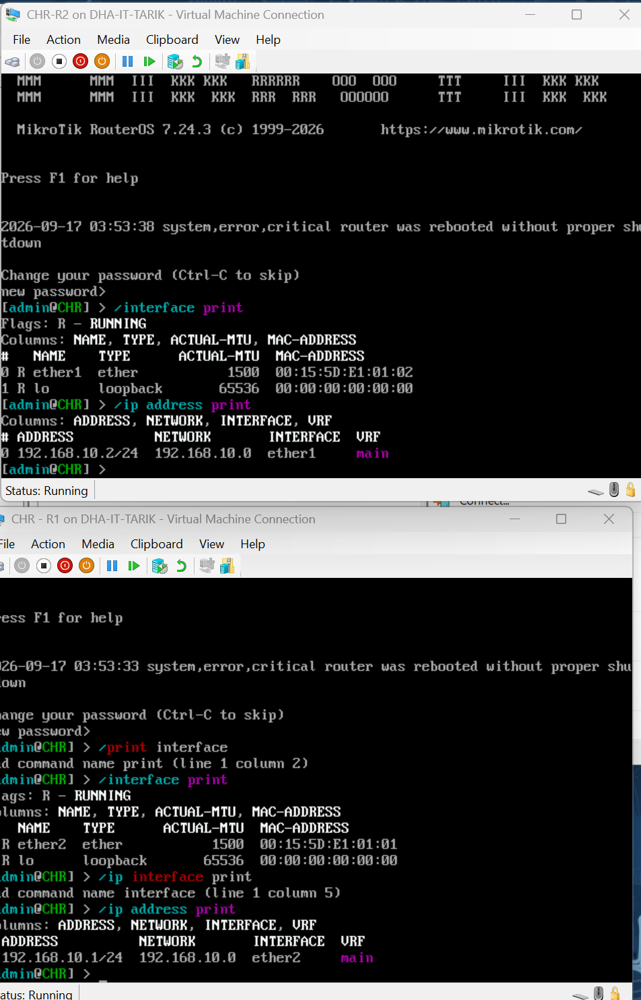
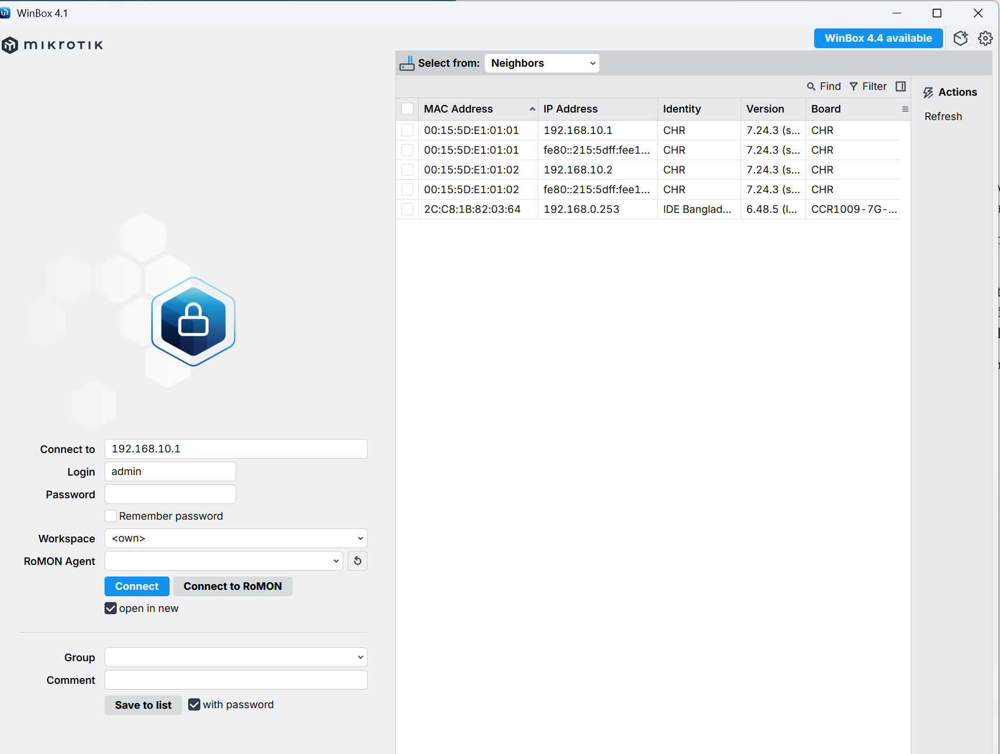

# MTCNA Lab: Virtualized MikroTik RouterOS Environment

A self-built virtual lab for studying toward the MikroTik Certified Network Associate (MTCNA) certification — built entirely on free tooling, on a single Windows laptop, with no physical MikroTik hardware.

## Why this exists

MTCNA study is normally done against real MikroTik routers or in paid lab environments. This project set out to answer: how much of the syllabus can be replicated for free using virtualization, and what does it actually take to get there on ordinary hardware?

Short answer: almost all of it. Longer answer is below — including the parts that didn't work on the first try, which turned out to be the more instructive part of the project.

## Project Scope: Simulated Enterprise Network

Rather than working through MTCNA's modules as isolated, disposable exercises, this lab is built as **one connected company network** that grows module by module — closer to what the certification is actually meant to prepare someone to run, and a more honest demonstration of applied skill than a series of unrelated configs.

**Resources used to build it:**

| Role | Implementation | Count |
|---|---|---|
| Routers | MikroTik CHR — the two already built for the initial setup are repurposed: `CHR-R1` becomes `HQ-Router`, `CHR-R2` becomes `Branch-Router` | 2 |
| Client / server endpoints | Alpine Linux VMs (lightweight, free), added incrementally as each module needs one | up to 6 |
| Switching | RouterOS bridging on CHR — a virtual lab has no dedicated switch-chip hardware, which is noted here as a known, honest gap rather than glossed over | — |
| WAN | Hyper-V's Default Switch, giving `HQ-Router` a real DHCP-assigned address from the actual internet connection | — |

**How each MTCNA module maps onto building it:**

| Module | What it builds |
|---|---|
| 1. Introduction | `HQ-Router` identity, licensing, initial WAN/LAN configuration |
| 2. DHCP | A DHCP server per VLAN (IT, Finance, HR, Guest, Branch) |
| 3. Bridging | The VLAN segments themselves |
| 4. Routing | Inter-VLAN routing on `HQ-Router`, static routes to the Branch |
| 5. Wireless | Documented gap — needs physical hardware, not virtualizable |
| 6. Firewall | DMZ lockdown, Guest isolation from internal VLANs, NAT |
| 7. QoS | Per-VLAN bandwidth limits (e.g. Guest capped, IT prioritized) |
| 8. Tunnels | The actual HQ ↔ Branch site-to-site VPN |
| 9. Network Management | Monitoring and backups across the whole network |

## Host Networking Setup

The section below covers the underlying Hyper-V/Windows plumbing that the company network above actually runs on.

Two MikroTik Cloud Hosted Router (CHR) virtual machines, connected via a Hyper-V Internal virtual switch, managed from the host over Winbox — MikroTik's native GUI tool.

## Tools used

| Tool | Purpose | Cost |
|---|---|---|
| MikroTik CHR (RouterOS 7.24.3) | The router OS itself, free license tier | Free |
| Hyper-V | Hypervisor hosting the router VMs | Free (built into Windows 11 Pro) |
| Winbox | Native MikroTik GUI management tool | Free |

## The build, step by step

### 1. Initial plan: GNS3 + VMware nested virtualization

The original plan was GNS3 (for a drag-and-drop topology canvas) running CHR nodes through a nested VMware VM. This hit an immediate wall:

Diagnosis via `msinfo32` showed **Virtualization-based Security (VBS)** running by default — standard on newer Windows 11 hardware — with a UEFI-locked configuration that survived registry edits, feature toggles, and `bcdedit` changes. This is a genuinely common blocker on modern Windows laptops attempting nested virtualization, and it can cost real time if you don't know what you're looking at.

**Decision:** rather than continuing to fight Windows for control of the hypervisor, pivot to running the router VMs *natively under Hyper-V* — the hypervisor Windows was already insisting on running — instead of a second, competing one. MikroTik officially supports CHR as a Hyper-V guest.

### 2. Bringing up the first router

Enabled the Hyper-V Windows feature, downloaded CHR's `.vhdx` image directly from MikroTik, and created a Generation 1 VM pointed at it (CHR requires Gen 1 — it won't boot on Gen 2).

### 3. Interface-mapping troubleshooting

A default Hyper-V VM setup left an extra, disconnected network adapter attached to each router. This caused a real debugging moment: an IP address configured on `ether1` silently failed to ping, because the *actually connected* interface was `ether2` — Hyper-V's adapter list order doesn't reliably predict RouterOS's interface naming.

**Fix:** always check `/interface print` and its **R** (running) flag before trusting an interface name — a habit that also applies to physical MikroTik hardware with multiple ports.

### 4. Clean two-router topology, verified

After removing the extra unused adapters and standardizing on a single interface per router:

Both routers confirmed reachable from each other on `192.168.10.0/24`.

### 5. Enabling GUI management (Winbox)

By default, Hyper-V's virtual switches don't let the host machine talk to the guest VMs — only the guests can talk to each other. Getting Winbox (running on the host) to see the routers required switching from a **Private** virtual switch to an **Internal** one (which exposes a host-side virtual adapter), then correcting Windows' network profile classification for that adapter from Public to Private so the firewall would allow the traffic through.

## Module 1 — Introduction ✅

RouterOS identity, licensing, and all three real-world WAN types configured on `HQ-Router`: DHCP-client (real internet via Default Switch), Static/Manual (point-to-point `/30` link to a simulated ISP), and PPPoE-client (authenticated session with ISP-Sim acting as the server). NAT masquerade rule added. Routing table with multiple default routes examined and flag system understood.

→ [Full Module 1 writeup](./modules/module-01-introduction.md)

---

## Skills demonstrated

- Virtualization troubleshooting (VBS/HVCI conflicts, nested virtualization limitations, hypervisor selection trade-offs)
- Windows networking internals (virtual switches, network profile classification, firewall rules)
- RouterOS fundamentals (interface identification, IP addressing, licensing)
- Systematic debugging: diagnosing from symptom (failed ping) back to root cause (wrong interface) rather than guessing
- WAN configuration: DHCP-client, Static/Manual, and PPPoE-client — all three real-world ISP connection types
- NAT masquerade (srcnat rule enabling internal hosts to share a single public IP)
- Routing table interpretation: reading RouterOS route flags (AS+, DAd, DAC) to understand active path selection
- Simulated ISP setup: configured a CHR as a PPPoE server with user authentication — the ISP side of the connection

## Roadmap

- [x] Module 1 — Introduction (RouterOS software, licensing, `HQ-Router` initial setup, all 3 WAN types)
- [ ] Module 2 — DHCP (per-VLAN DHCP servers)
- [ ] Module 3 — Bridging (IT / Finance / HR / Guest / DMZ segments)
- [ ] Module 4 — Routing (inter-VLAN + HQ ↔ Branch static routing)
- [ ] Module 5 — Wireless *(requires physical hardware — documented gap, not virtualizable)*
- [ ] Module 6 — Firewall (DMZ lockdown, Guest isolation, NAT)
- [ ] Module 7 — QoS (per-VLAN bandwidth limits)
- [ ] Module 8 — Tunnels (HQ ↔ Branch site-to-site VPN)
- [ ] Module 9 — Network Management (Torch, Netwatch, backups)

---

*Part of ongoing MTCNA self-study. Built on a Windows 11 laptop with 16GB RAM, no physical MikroTik hardware, no paid licenses.*
