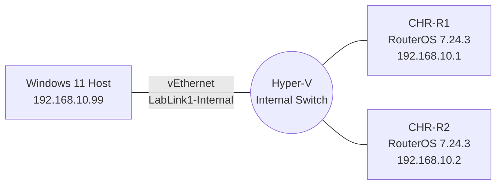

# MTCNA Lab: Virtualized MikroTik RouterOS Environment

A self-built virtual lab for studying toward the MikroTik Certified Network Associate (MTCNA) certification — built entirely on free tooling, on a single Windows laptop, with no physical MikroTik hardware.

## Why this exists

MTCNA study is normally done against real MikroTik routers or in paid lab environments. This project set out to answer: how much of the syllabus can be replicated for free using virtualization, and what does it actually take to get there on ordinary hardware?

Short answer: almost all of it. Longer answer is below — including the parts that didn't work on the first try, which turned out to be the more instructive part of the project.

## Lab Architecture

Two MikroTik Cloud Hosted Router (CHR) virtual machines, connected via a Hyper-V Internal virtual switch, managed from the host over Winbox — MikroTik's native GUI tool.

## Tools used

| Tool | Purpose | Cost |
|---|---|---|
| MikroTik CHR (RouterOS 7.24.3) | The router OS itself, free license tier | Free |
| Hyper-V | Hypervisor hosting the router VMs | Free (built into Windows 11 Pro) |
| Winbox | Native MikroTik GUI management tool | Free |

## The build, step by step

### 1. Initial plan: GNS3 + VMware nested virtualization

The original plan was GNS3 (for a drag-and-drop topology canvas) running CHR nodes through a nested VMware VM. This hit an immediate wall:

Diagnosis via `msinfo32` showed **Virtualization-based Security (VBS)** running by default — standard on newer Windows 11 hardware — with a UEFI-locked configuration that survived registry edits, feature toggles, and `bcdedit` changes. This is a genuinely common blocker on modern Windows laptops attempting nested virtualization, and it can cost real time if you don't know what you're looking at.

**Decision:** rather than continuing to fight Windows for control of the hypervisor, pivot to running the router VMs *natively under Hyper-V* — the hypervisor Windows was already insisting on running — instead of a second, competing one. MikroTik officially supports CHR as a Hyper-V guest.

### 2. Bringing up the first router

Enabled the Hyper-V Windows feature, downloaded CHR's `.vhdx` image directly from MikroTik, and created a Generation 1 VM pointed at it (CHR requires Gen 1 — it won't boot on Gen 2).

### 3. Interface-mapping troubleshooting

A default Hyper-V VM setup left an extra, disconnected network adapter attached to each router. This caused a real debugging moment: an IP address configured on `ether1` silently failed to ping, because the *actually connected* interface was `ether2` — Hyper-V's adapter list order doesn't reliably predict RouterOS's interface naming.

**Fix:** always check `/interface print` and its **R** (running) flag before trusting an interface name — a habit that also applies to physical MikroTik hardware with multiple ports.

### 4. Clean two-router topology, verified

After removing the extra unused adapters and standardizing on a single interface per router:

Both routers confirmed reachable from each other on `192.168.10.0/24`.

### 5. Enabling GUI management (Winbox)

By default, Hyper-V's virtual switches don't let the host machine talk to the guest VMs — only the guests can talk to each other. Getting Winbox (running on the host) to see the routers required switching from a **Private** virtual switch to an **Internal** one (which exposes a host-side virtual adapter), then correcting Windows' network profile classification for that adapter from Public to Private so the firewall would allow the traffic through.

## Skills demonstrated

- Virtualization troubleshooting (VBS/HVCI conflicts, nested virtualization limitations, hypervisor selection trade-offs)
- Windows networking internals (virtual switches, network profile classification, firewall rules)
- RouterOS fundamentals (interface identification, IP addressing, licensing)
- Systematic debugging: diagnosing from symptom (failed ping) back to root cause (wrong interface) rather than guessing

## Roadmap

- [ ] Module 1 — RouterOS software, licensing, initial configuration
- [ ] Module 2 — Bridging
- [ ] Module 3 — Routing (static routing between subnets)
- [ ] Module 4 — DHCP
- [ ] Module 5 — Wireless *(requires physical hardware — not virtualizable)*
- [ ] Module 6 — Firewalls
- [ ] Module 7 — QoS / Simple Queues
- [ ] Module 8 — Tunnels (PPTP/L2TP/PPPoE)
- [ ] Module 9 — Network Management (Torch, Netwatch, backups)

---

*Part of ongoing MTCNA self-study. Built on a Windows 11 laptop with 16GB RAM, no physical MikroTik hardware, no paid licenses.*
