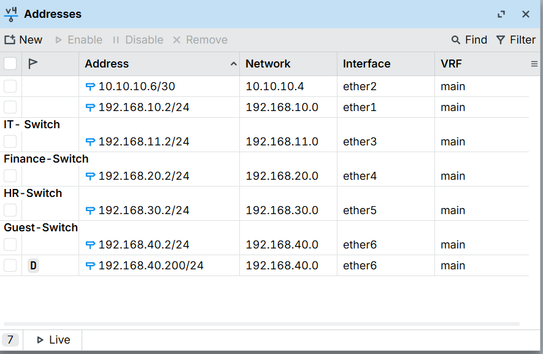
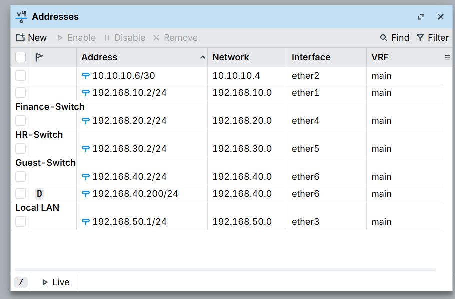
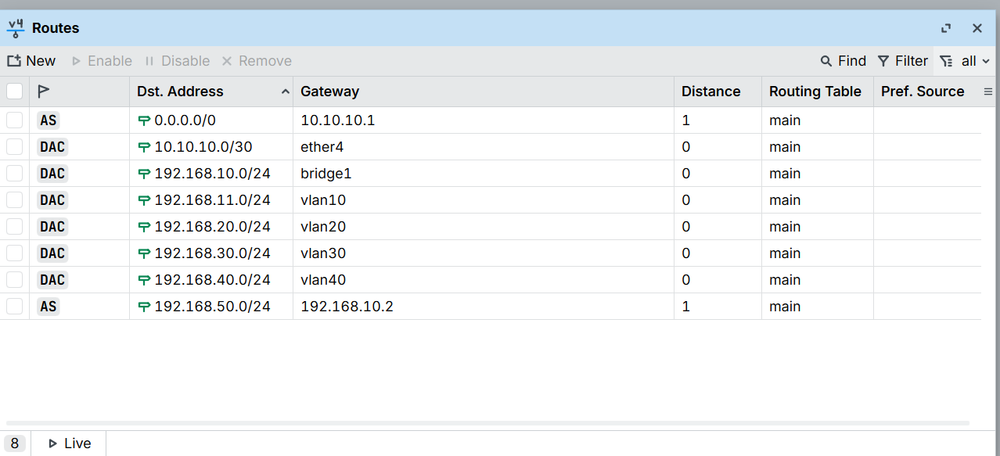
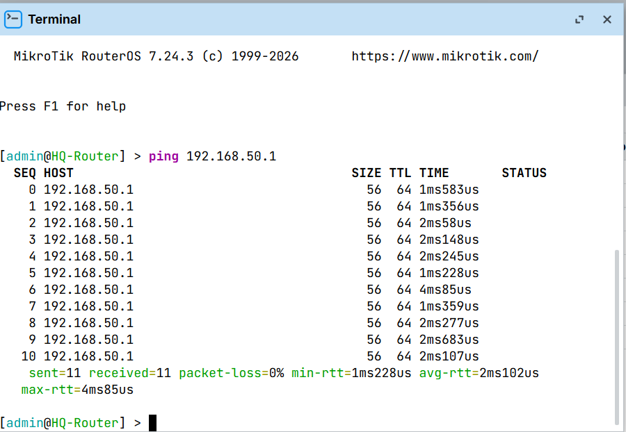
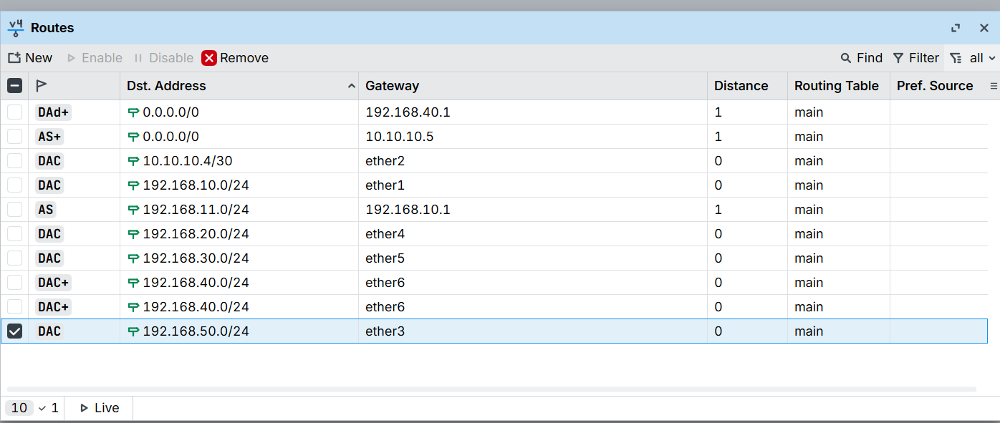
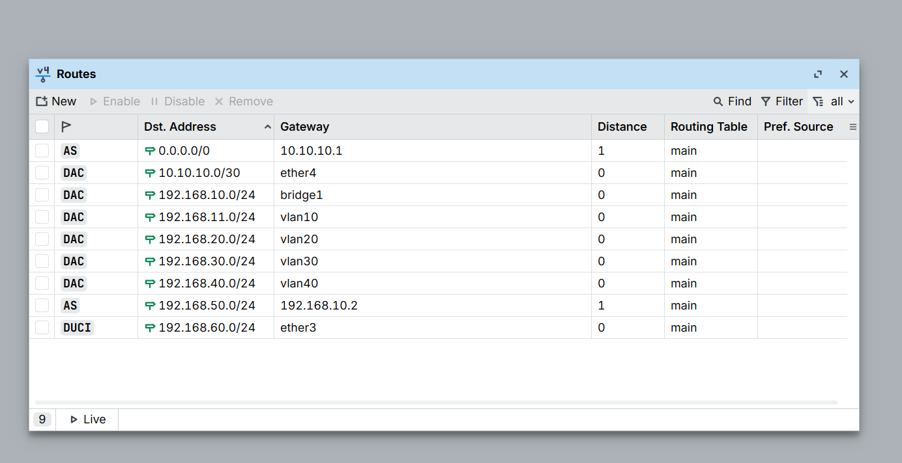
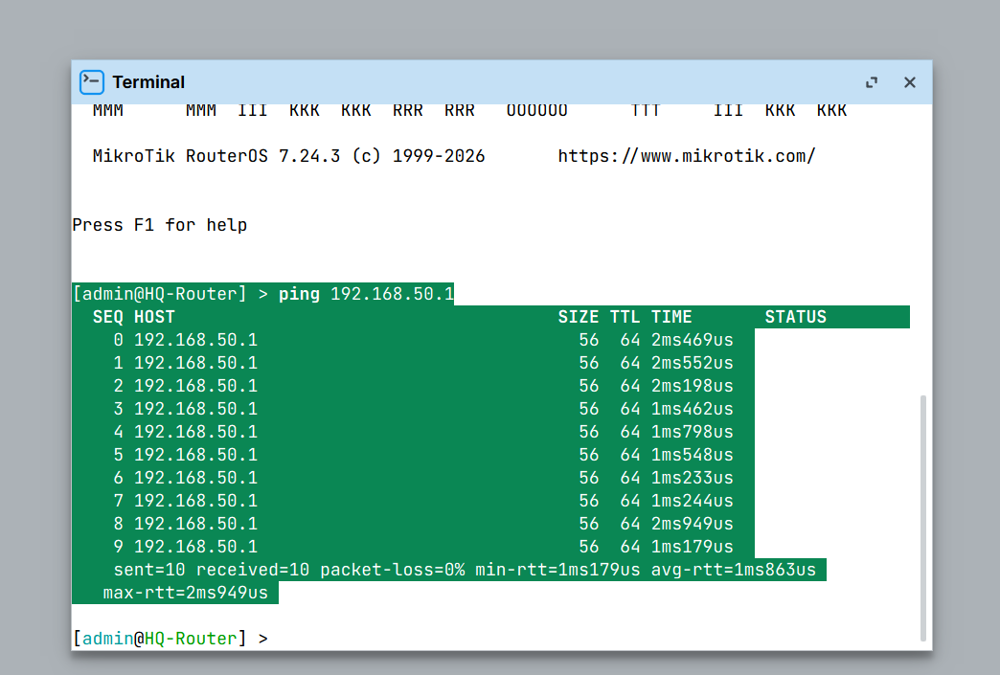

# Module 4 – Routing

**Goal:** Understand how a MikroTik router decides where to send packets, and connect the HQ and Branch offices with static routes.

**Lab:** HQ-Router (CHR-R1), Branch-Router (CHR-R2) and ISP-Sim (CHR-R3) on Hyper-V, configured through Winbox.

---

## 1. Topology and addressing used in this module

| Router | Interface | Address | Purpose |
|---|---|---|---|
| HQ-Router | bridge1 (ether2) | 192.168.10.1/24 | Management link to Branch |
| HQ-Router | ether4 | 10.10.10.2/30 | Link to ISP-Sim |
| HQ-Router | vlan10 / 20 / 30 / 40 | 192.168.11.1 / 20.1 / 30.1 / 40.1 (/24) | IT, Finance, HR, Guest |
| Branch-Router | ether1 | 192.168.10.2/24 | Management link to HQ |
| Branch-Router | ether2 | 10.10.10.6/30 | Link to ISP-Sim |
| Branch-Router | ether3 | 192.168.50.1/24 | **Branch office LAN (new in this module)** |
| ISP-Sim | ether1 | 10.10.10.1/30 and 10.10.10.5/30 | One address per link |

---

## 2. Concepts

### The routing table
Every route has three key parts:
- **Dst. Address** – the network the route leads to
- **Gateway** – the directly reachable neighbour to hand the packet to
- **Distance** – how much the router trusts the route (lower is better)

### Route flags

| Flag | Meaning |
|---|---|
| D | Dynamic – added by RouterOS, not by the administrator |
| A | Active – currently in use |
| c | Connected – a directly attached network |
| S | Static – added manually |
| d | Learned from DHCP |
| + | ECMP – more than one gateway of equal cost |

When an IP address is assigned to an interface, RouterOS uses the address and mask to work out the whole network and adds a connected (DAc) route automatically.

### Choosing Dst and Gateway
Every static route comes from two questions:
1. **Where do I want to go?** A network the router is *not* directly attached to.
2. **Which directly reachable neighbour is on the way?**

**Gateway rule:** a gateway must be an IP address in the same subnet as one of the router's directly connected interfaces.

### Most specific route wins
If several routes match a packet, the router uses the most specific one. A `/24` route beats the default route `0.0.0.0/0`.

### Why offices must not share a subnet
A connected route makes a router treat every address in that network as local. If HQ and Branch both use the same subnet, neither router will forward traffic for it toward the other office.

---

## 3. Lab steps

### 3.1 Inspect HQ-Router's routing table
**IP → Routes** on HQ-Router shows:
- a static default route `0.0.0.0/0` via `10.10.10.1` (ISP-Sim)
- connected (DAc) routes for `192.168.10.0/24` and the four VLAN networks


### 3.2 Find the problem: Branch shares subnets with HQ
In Module 3 Branch-Router was given `.2` test addresses on ether3–ether6 to test the department VLANs. That made it act like a device on HQ's VLANs instead of a separate office, and its networks overlap with HQ's.



### 3.3 Give Branch its own LAN subnet
Chosen Branch LAN: **192.168.50.0/24**, which is not used anywhere else in the lab.

On Branch-Router, **IP → Addresses**: changed ether3 from `192.168.11.2/24` to `192.168.50.1/24`.



RouterOS immediately added a connected route (**DAc**) for `192.168.50.0/24`.


### 3.4 Static route on HQ-Router to the Branch LAN
**IP → Routes → +** on HQ-Router:

| Field | Value |
|---|---|
| Dst. Address | 192.168.50.0/24 |
| Gateway | 192.168.10.2 |

`192.168.10.2` is in the same subnet as HQ's own `192.168.10.1/24`, so it satisfies the gateway rule. The route shows flags **AS** (active, static).



### 3.5 Verify from HQ-Router
Ping to the Branch LAN gateway: 11 sent, 11 received, 0% packet loss.



The reply found its way back without any added route on Branch, because the ping's source address (`192.168.10.1`) is on ether1, a network Branch is directly attached to.

### 3.6 Static route on Branch-Router to HQ's IT network
Before adding the route, Branch-Router already reached `192.168.11.1`:

```
[admin@Branch-Router] > ping 192.168.11.1
  SEQ HOST                                     SIZE TTL TIME       STATUS
    0 192.168.11.1                                                 timeout
    1 192.168.11.1                               56  64 2ms516us
    2 192.168.11.1                               56  64 4ms59us
    ...
    sent=14 received=13 packet-loss=7% min-rtt=911us avg-rtt=1ms527us
```

`/ip route check` showed why:

```
[admin@Branch-Router] > ip route check 192.168.11.1
     status: ok
  interface: ether6
    nexthop: 192.168.40.1
```

Branch had a **DHCP-learned default route** (`0.0.0.0/0`, flags **DAd+**) through HQ's Guest VLAN gateway `192.168.40.1`, installed by a DHCP client on ether6. Packets with no specific route were sent there, and HQ delivered them.



Added a specific static route on Branch-Router:

| Field | Value |
|---|---|
| Dst. Address | 192.168.11.0/24 |
| Gateway | 192.168.10.1 |



Checked again:

```
[admin@Branch-Router] > ip route check 192.168.11.1
     status: ok
  interface: ether1
    nexthop: 192.168.10.1
```

The `/24` static route is more specific than the `/0` default route, so Branch now uses ether1 via `192.168.10.1`.



---

## 4. Troubleshooting and lessons learned

| Issue | What happened | Lesson |
|---|---|---|
| Invalid gateway | A route on HQ-Router for `192.168.10.0/24` via `10.10.10.6` used a gateway on a network HQ has no interface in (`10.10.10.4/30`) | A gateway must share a subnet with one of the router's own interfaces |
| Unneeded route | `192.168.10.0/24` is already attached to HQ (DAc), so no static route was needed | Static routes are only for networks the router is not directly attached to |
| Overlapping subnets | Branch's test addresses used HQ's 11/20/30/40 networks | Two offices that need to route to each other must use different subnets |
| Unexpected connectivity | Ping to `192.168.11.1` worked before any static route existed | A DHCP-learned default route (DAd+) was silently providing a path. Use `/ip route check` to see which route is really used |

---

## 5. Summary
- Connected routes (DAc) appear automatically when an interface gets an IP address.
- Static routes (S) are added manually for networks the router cannot see directly.
- A gateway must be in the same subnet as one of the router's directly connected interfaces.
- The most specific matching route wins; `0.0.0.0/0` is the fallback.
- Each direction of traffic needs its own route, and each office needs its own subnet.
- `/ip route check <address>` shows which route and gateway a router will use.

## 6. Still to do
- Clean up the remaining overlapping test addresses on Branch-Router (ether4–ether6) and the DHCP client on ether6.
- Routes from Branch to HQ's Finance, HR and Guest networks (20, 30, 40).
- Dynamic routing concepts overview.
