# Module 6 – Firewall, NAT and DMZ

**Goal:** Protect HQ-Router with filter rules, let private networks reach the internet with source NAT, publish an inside service with destination NAT, and build a DMZ that outsiders can reach but that cannot reach the internal networks.

**Lab:** HQ-Router, Branch-Router and ISP-Sim (MikroTik CHR 7.24.3) on Hyper-V, configured through Winbox. The routers are managed by MAC address, which is not affected by IP firewall rules.

---

## 1. Concepts

### 1.1 Firewall rules
A firewall rule is a sentence: **"if a packet looks like this, do that."**
- The **match** says what the packet looks like (source, destination, interface, connection state).
- The **action** says what to do with it, usually `accept` or `drop`.

Rules are checked from top to bottom and the **first match wins**. A packet that matches no rule is **accepted**.

### 1.2 The three chains

| Chain | The router is the... | Example |
|---|---|---|
| **input** | Destination | Winbox session to HQ-Router |
| **forward** | Middleman | A PC in one VLAN reaching another network |
| **output** | Sender | A ping typed in the router's own terminal |

A ping started by the router uses **output** for the request and **input** for the reply. Traffic passing through the router uses **forward** in both directions.

### 1.3 Replies: established and related
Every conversation has two directions. A drop rule that matches by interface or address also catches the **replies** to conversations the router started. A rule accepting **established, related** traffic fixes this:
- **new**: the first packet of a conversation
- **established**: a packet in a conversation already going
- **related**: a packet tied to one, such as an error message about it

This accept rule goes **above** the drop rules and is needed **once per chain**. A second copy in the same chain does nothing.

### 1.4 Address masks
The number after the slash says how many leading bits are fixed.
- `192.168.0.0/24` matches only addresses starting `192.168.0.`
- `192.168.0.0/16` matches every address starting `192.168.`

### 1.5 NAT
NAT rewrites addresses instead of allowing or blocking.

| Type | Direction | Rewrites | Why |
|---|---|---|---|
| **srcnat** (masquerade) | Leaving | Source address | Private addresses are not routable outside, so replies could not return |
| **dstnat** | Arriving | Destination address and port | Outsiders can only see the router's address, not the private server |

A NAT rule is only evaluated for the first packet of a connection. The router remembers the rewrite for the rest of the connection, so a rule's packet counter shows 1 for a whole ping run.

### 1.6 The DMZ
A DMZ is a separate network for servers that outsiders need to reach. A server that the outside can reach is the most likely to be attacked, so it must not sit next to the internal networks.

| Direction | Allowed? | Delivered by |
|---|---|---|
| Internet to DMZ | Yes (only the published service) | dstnat rule |
| Internal to DMZ | Yes | No blocking rule, replies accepted by the established/related rule |
| DMZ to internal | **No** | Forward drop rule |

---

## 2. Input rules: protecting HQ-Router from the ISP side

On HQ-Router, **IP → Firewall → Filter Rules**:

| # | Chain | Match | Action |
|---|---|---|---|
| 0 | input | Connection State: established, related | accept |
| 1 | input | In. Interface: ether4 | drop |

- Rule 0 accepts replies to conversations the router started (its own pings, lookups).
- Rule 1 drops every other new connection arriving on ether4, the ISP side.
- Rule 0 has no interface, because replies are accepted on any interface. Rule 1 names ether4 so that PCs on the internal networks can still reach the router's DHCP, DNS and management services.

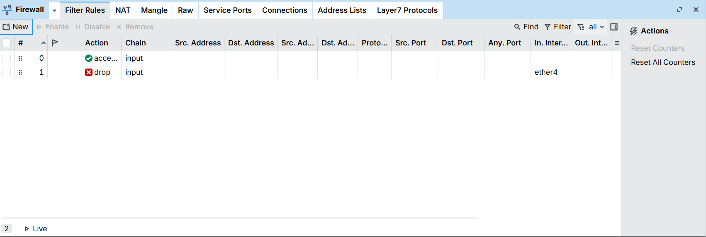

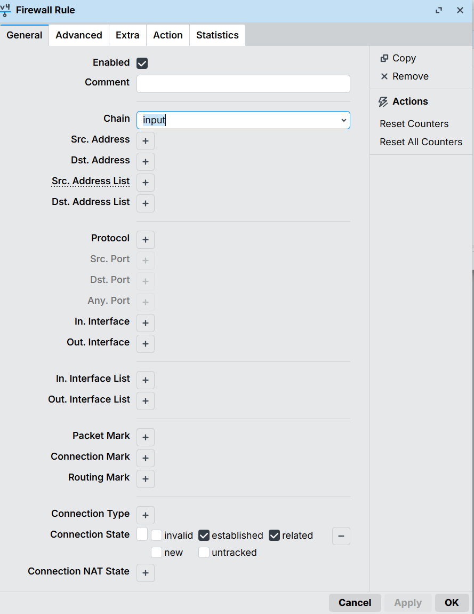

### Tests

| Test | Result | Why |
|---|---|---|
| HQ pings 10.10.10.1 (ISP-Sim) | 9 of 9 replies | Replies match rule 0 |
| ISP-Sim pings 10.10.10.2 (HQ ether4) | 0 of 9 replies | A new connection arriving on ether4 is dropped by rule 1 |

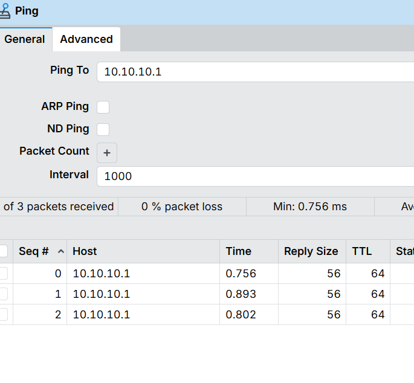

After the HQ ping, rule 0 counted 11 packets (the replies). Rule 1 counted 7 packets of other new traffic from ISP-Sim, and the forward rules stayed at 0 because the router's own pings never pass through the forward chain.

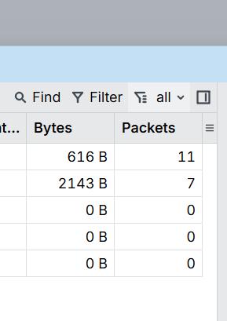

When ISP-Sim pinged HQ, rule 1's counter climbed to 27 packets and ISP-Sim got no replies.

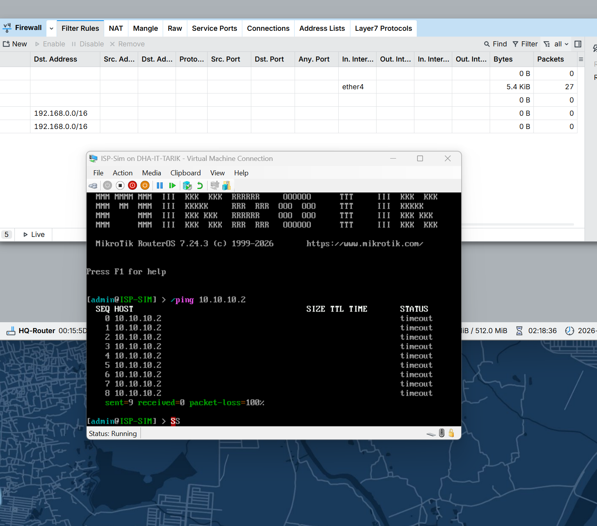

---

## 3. Why the replies rule matters

With rule 0 disabled (greyed row), HQ's own ping to `10.10.10.1` got **0 of 5** replies: the replies arrived on ether4, matched no accept rule and were dropped by rule 1.

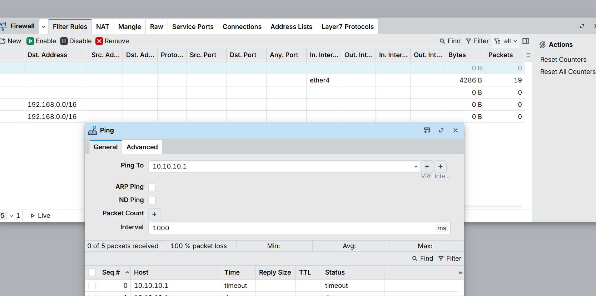

With rule 0 enabled again, **9 of 9** replies returned and rule 0 counted 8 packets.

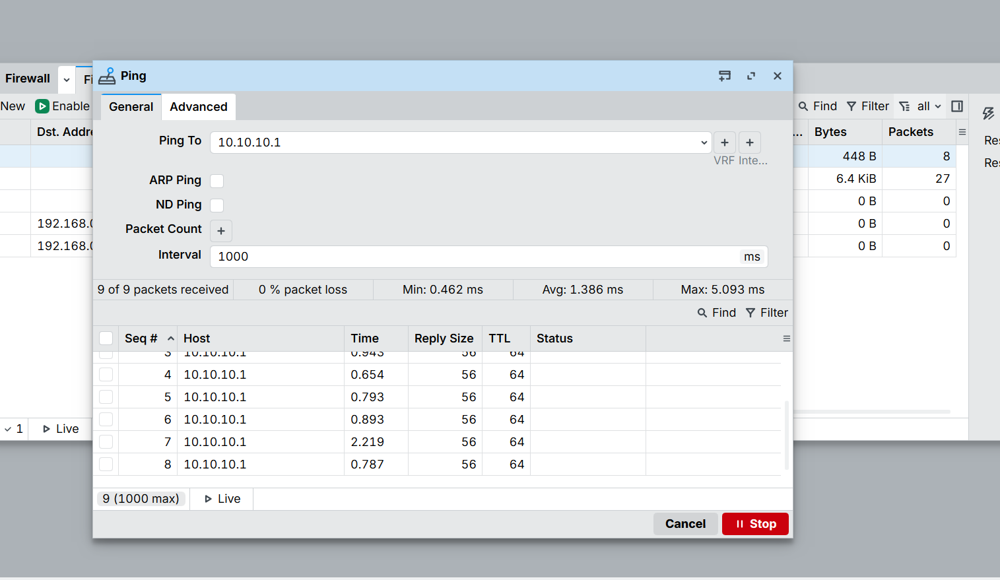

---

## 4. Source NAT (masquerade)

HQ's existing masquerade rule named **ether3**, left over from Module 3. The link to ISP-Sim is **ether4** (`10.10.10.2/30`), and ether3 had no address, so the rule never matched internet-bound traffic.

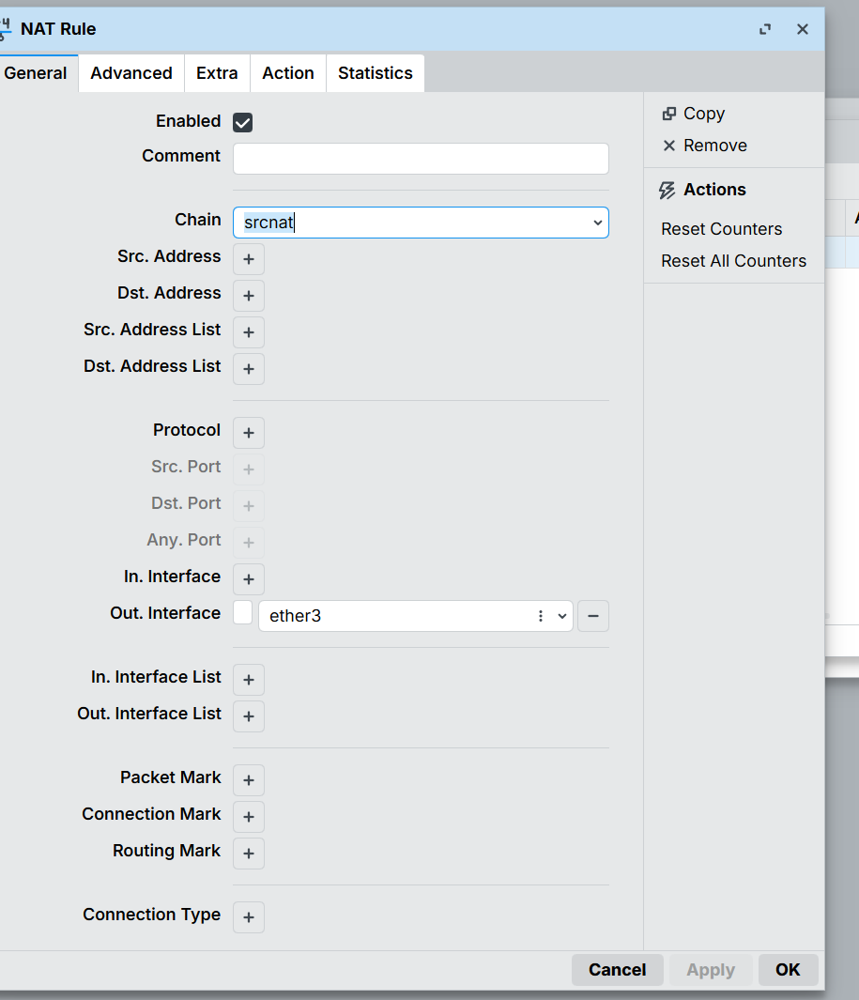

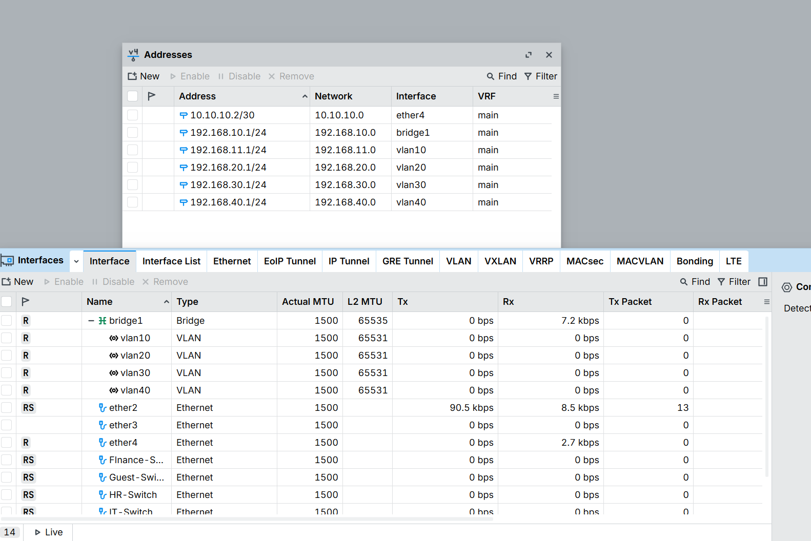

Rule, in **IP → Firewall → NAT**:

| Field | Value |
|---|---|
| Chain | srcnat |
| Out. Interface | ether4 |
| Action | masquerade |

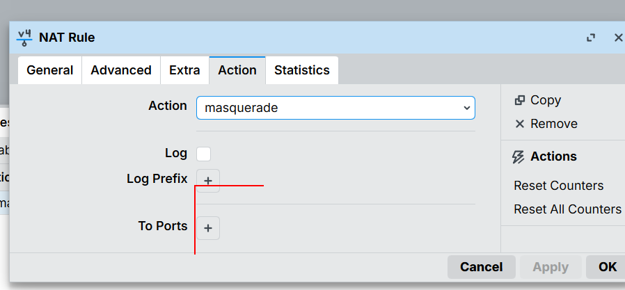

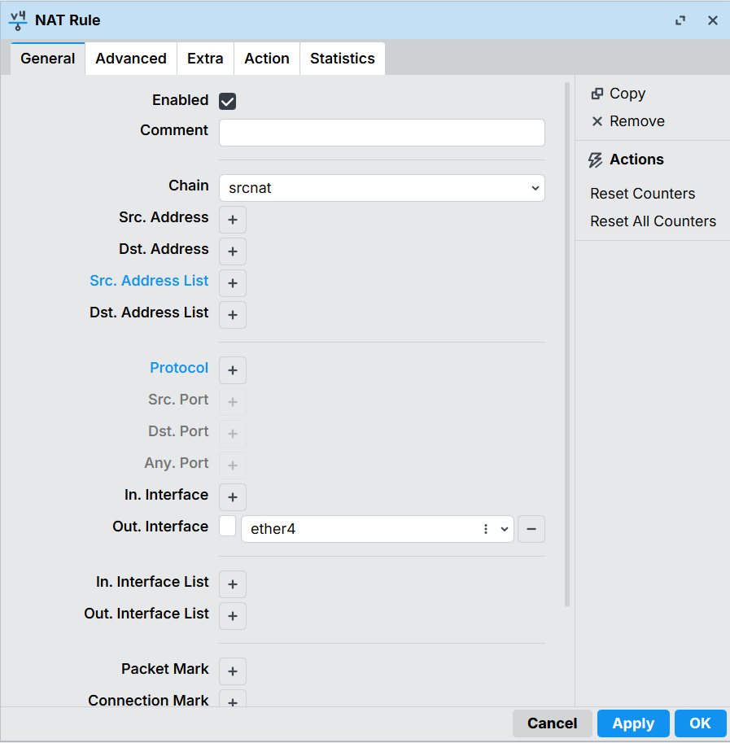

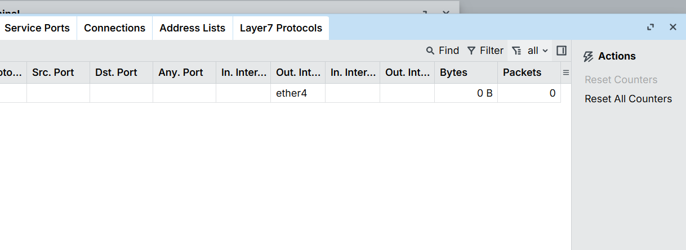

### Tests
A ping to `10.10.10.1` with **Src. Address** `192.168.20.1` (a Finance address):

| Masquerade rule | Replies | Rule counter |
|---|---|---|
| Enabled | 7 of 7 | 56 B / 1 packet |
| Disabled | 0 of 5 | 0 |
| Recreated | 4 of 4 | 56 B / 1 packet |

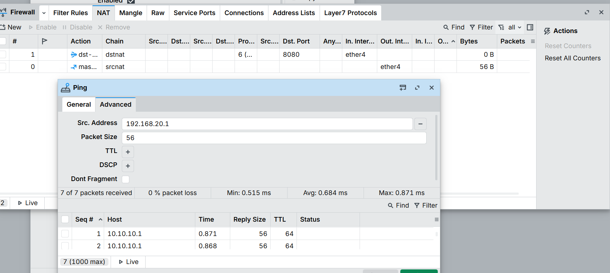

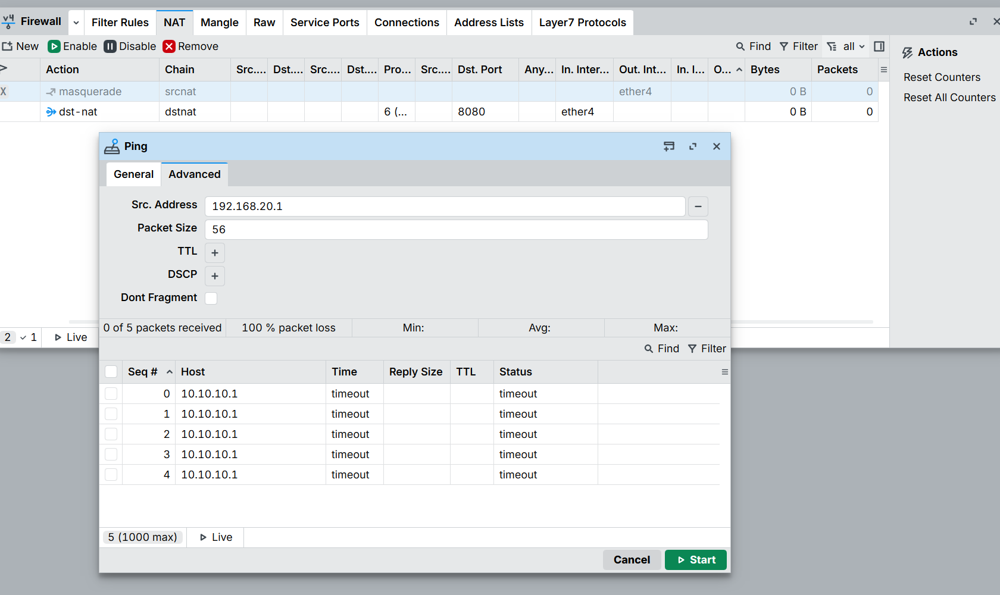

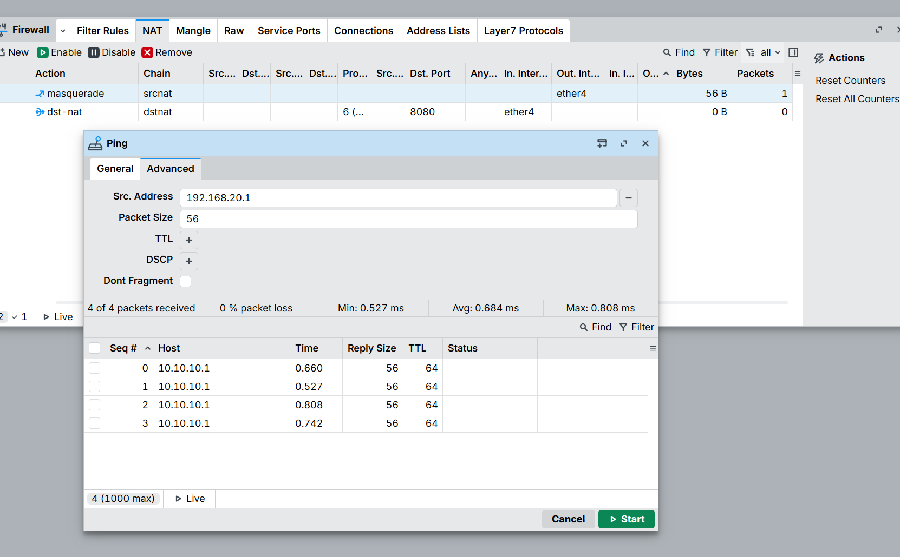

With masquerade on, the source is rewritten to `10.10.10.2`, which ISP-Sim shares a link with and can answer. With it off, the packet leaves with `192.168.20.1`, which ISP-Sim has no route to, so no reply returns.

---

## 5. Forward rules

Final filter rule list on HQ-Router:

| # | Chain | Match | Action |
|---|---|---|---|
| 0 | input | Connection State: established, related | accept |
| 1 | input | In. Interface: ether4 | drop |
| 2 | forward | Connection State: established, related | accept |
| 3 | forward | Src `192.168.40.0/24`, Dst `192.168.0.0/16` | drop |
| 4 | forward | Src `192.168.60.0/24`, Dst `192.168.0.0/16` | drop |

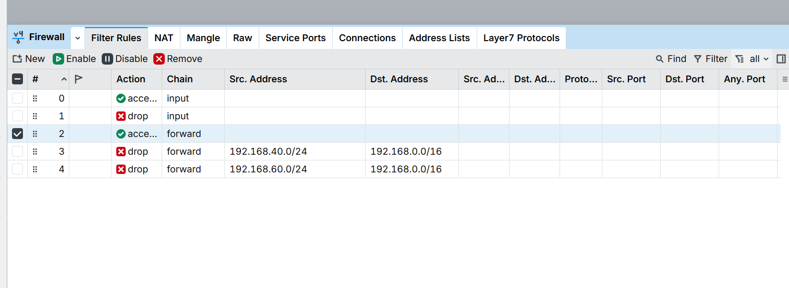

- **Rule 2** lets replies through when they belong to a conversation already going. It sits above the drops.
- **Rule 3** stops the Guest VLAN from starting connections to any internal network. It started as Guest to Finance only, and was widened to `/16` to cover every internal network and the DMZ.
- **Rule 4** stops the DMZ from starting connections to the internal networks. The DMZ can still reach the internet, because the drop only matches destinations inside `192.168.0.0/16`.
- Rules 3 and 4 can be in either order, because no packet has both source addresses. Order only matters when one packet can match several rules with different actions.

The rules match on **source and destination**, not on where traffic enters the router. A packet from the DMZ to an internal host has source `192.168.60.x` and destination `192.168.x.x`.

---

## 6. Building the DMZ

### Wiring
HQ-Router's **ether3** and Branch-Router's **ether6** are connected to a new Hyper-V **private** virtual switch named `DMZ-Link`. Branch-Router acts as the DMZ server, reusing ether6, whose leftover Module 3 test address and DHCP client were cleaned up.

| Step | Where | What |
|---|---|---|
| 1 | Hyper-V → Virtual Switch Manager | New private switch `DMZ-Link` |
| 2 | HQ-Router settings | The network adapter showing **Not connected** is ether3. Set its virtual switch to `DMZ-Link`. Ether3 then shows the **R** flag |
| 3 | Branch-Router settings | The adapter on the Guest switch is ether6. Set its virtual switch to `DMZ-Link` |

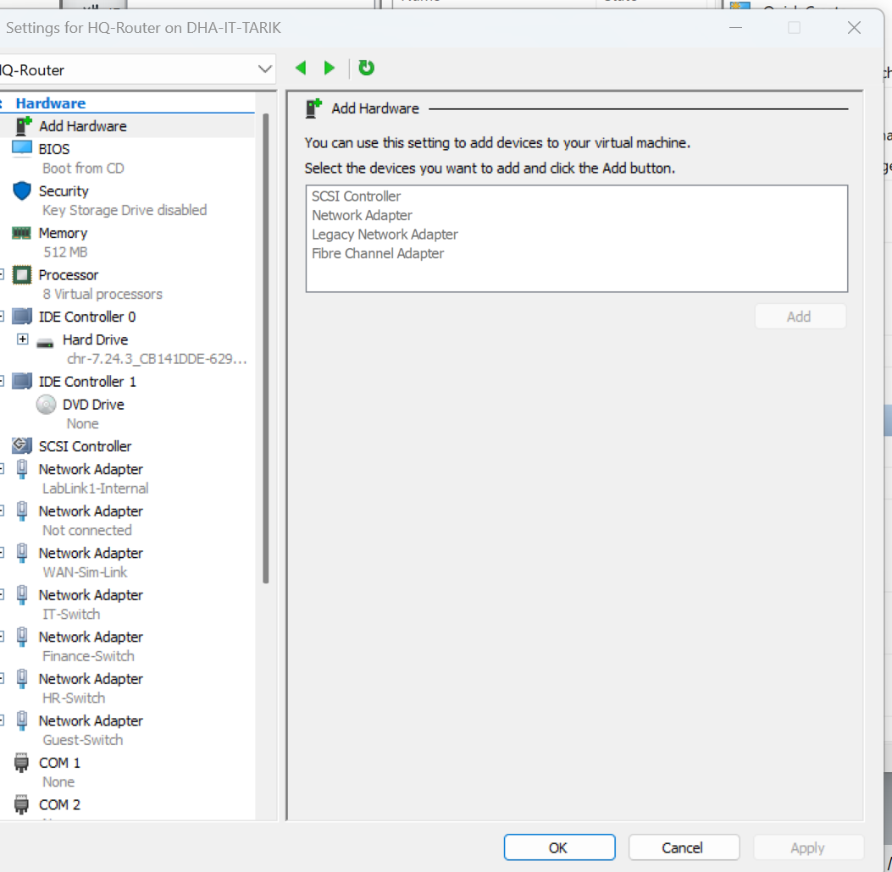

The adapter was identified by link state: ether3 was the only interface with no link and no **R** flag, and the only adapter showing Not connected.

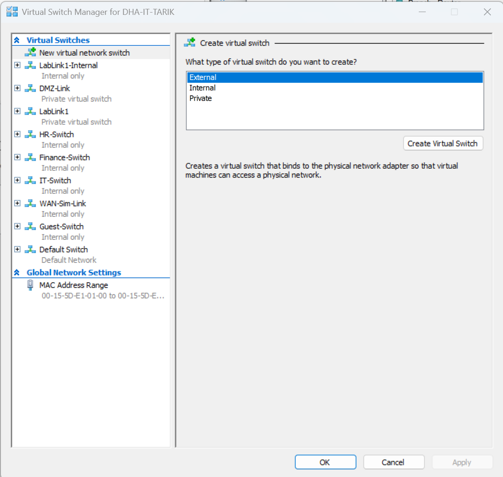

### Addressing
**HQ-Router**, **IP → Addresses:** `192.168.60.1/24` on ether3. The connected route appeared automatically and stayed inactive until the link came up, then became active (DAc).

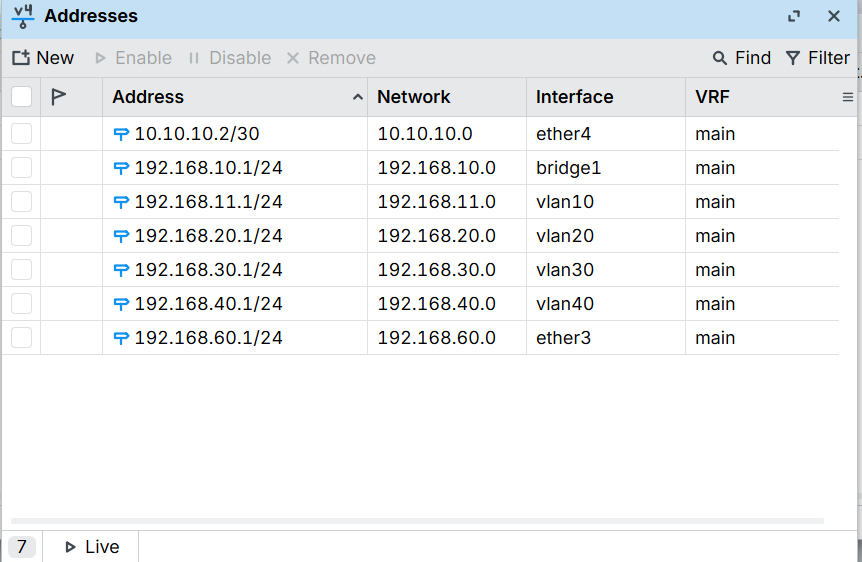

**Branch-Router:**
1. **IP → DHCP Client:** removed the client on ether6, which also removed the dynamic address and the DHCP default route.
2. **IP → Addresses:** `192.168.60.10/24` on ether6.
3. **IP → Routes:** Dst `0.0.0.0/0`, Gateway `192.168.60.1`. The gateway is in the same subnet as `192.168.60.10/24`, so it meets the gateway rule from Module 4.
4. **IP → Services:** `www` enabled on port 80.

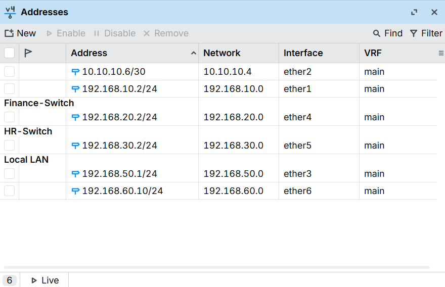

Branch's ether4 and ether5 still hold the Module 3 test addresses (`192.168.20.2` and `192.168.30.2`), which overlap HQ's Finance and HR networks.

HQ-Router can ping the DMZ server at `192.168.60.10`: 5 of 5 replies, which confirms the `DMZ-Link` connection and both addresses.

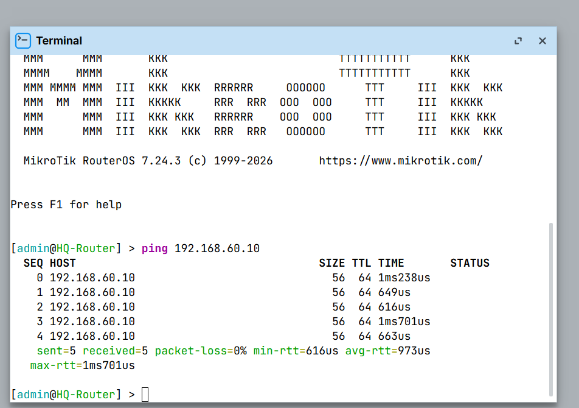

---

## 7. Destination NAT to the DMZ server

Rule on HQ-Router, **IP → Firewall → NAT:**

| Tab | Field | Value |
|---|---|---|
| General | Chain | dstnat |
| General | Protocol | tcp |
| General | Dst. Port | 8080 |
| General | In. Interface | ether4 |
| Action | Action | dst-nat |
| Action | To Addresses | 192.168.60.10 |
| Action | To Ports | 80 |

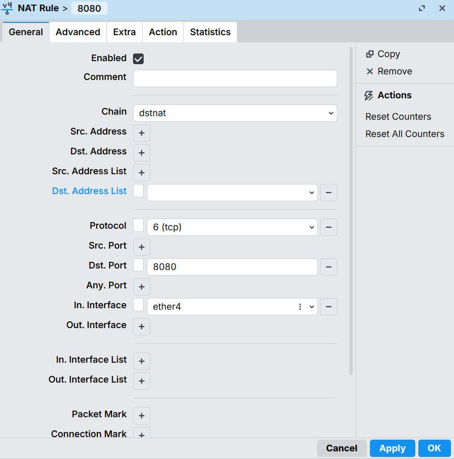

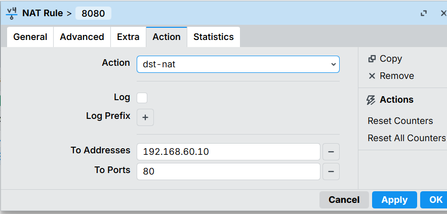

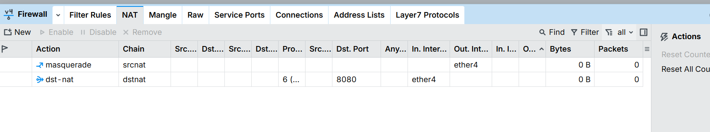

Visitors use port **8080** on HQ's address `10.10.10.2`, and HQ passes the connection to port **80** on the DMZ server. 8080 keeps the two ports distinct and avoids clashing with HQ's own web service on port 80. After the rewrite the traffic is **forward** traffic, so the input drop on ether4 does not block it.

The rule was first tested pointing at Branch's management address (`192.168.10.2:80`): a fetch from ISP-Sim finished and the rule counted 60 B / 1 packet. The target was then changed to the DMZ address.

---

## 8. Test status

| Goal | Test | Status |
|---|---|---|
| DMZ link | HQ pings the DMZ server at `192.168.60.10` | Done |
| Replies accepted | HQ pings ISP-Sim, with and without rule 0 | Done |
| Input protection | ISP-Sim pings HQ's ether4 address | Done |
| Source NAT | Ping from a Finance source address, masquerade on and off | Done |
| Destination NAT | Connection from ISP-Sim to `10.10.10.2:8080` reaches the DMZ server | Pending |
| DMZ reaches the internet | Branch pings `10.10.10.1` with Src. Address `192.168.60.10` | Pending |
| DMZ blocked from internal | DMZ server to a host behind HQ, such as a PC on a department VLAN | Pending |
| Guest blocked from internal | Guest device to an internal host | Pending |

The DMZ-to-internal test needs a host behind HQ. HQ-Router's own addresses (such as `192.168.20.1`) do not count, because traffic to them is **input**, not forward, and never reaches the forward rule.

---

## 9. Troubleshooting and lessons learned

| Issue | What happened | Lesson |
|---|---|---|
| Ping: host unreachable | ISP-Sim's VM was shut down, so HQ could not find `10.10.10.1` | Check that the device is running before suspecting a firewall rule |
| Wrong mask | A DMZ rule used `192.168.0.0/24`, which matches only `192.168.0.x`, so the DMZ could reach every internal network | Check the mask: `/16` covers `192.168.x.x` |
| Masquerade on the wrong interface | The rule named ether3, not the interface the traffic leaves through | Masquerade only touches packets leaving through the interface named in the rule |
| Duplicate accept rule | A second established/related rule in the forward chain did nothing | One accept rule per chain is enough |
| Counter shows 1 for several pings | NAT only evaluates the first packet of a connection | Reset counters before a test and expect low numbers |
| Testing the DMZ block against HQ's address | Traffic to the router's own address is input, not forward | Test against a host behind the router |

Ping to ISP-Sim while its VM was shut down (host unreachable, then timeouts):

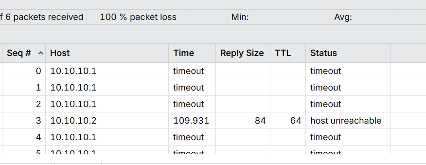

---

## 10. Summary
- Rules are `match + action`, checked top to bottom, first match wins, and no match means accept.
- Three chains: input (to the router), forward (through it), output (from it).
- An established/related accept rule above the drops keeps replies working. One per chain.
- Masquerade rewrites the source of outgoing traffic so replies can return.
- dstnat rewrites the destination of incoming traffic so outsiders can reach an inside server.
- A DMZ keeps public servers in their own network: reachable from outside, blocked from the internal networks.
- Rules match on source and destination, not on where the traffic enters.

## 11. Still to do
- Run the pending tests in section 8.
- Capture the results of the pending tests, plus HQ's active DMZ route and Branch's default route.
