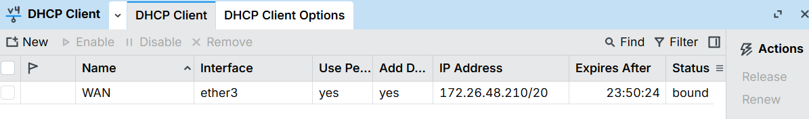
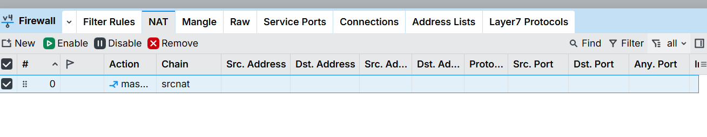
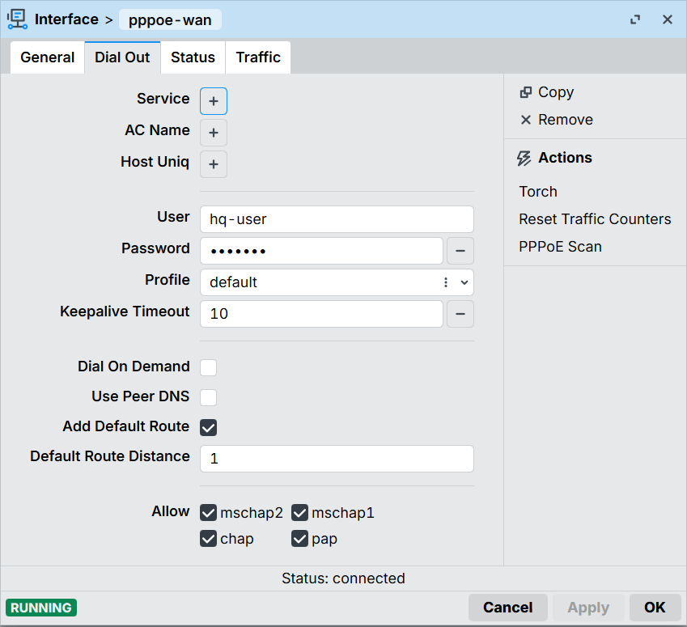
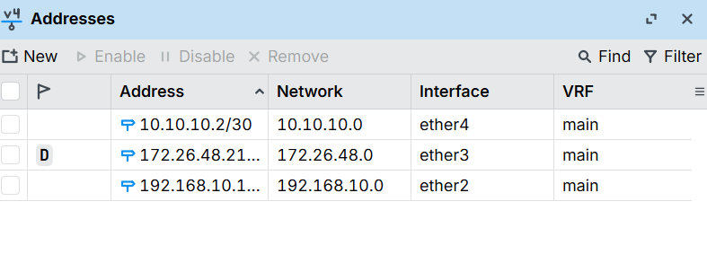
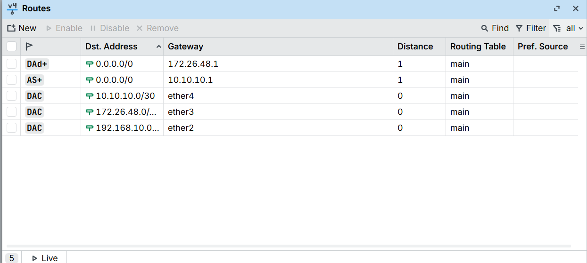

# Module 1 — Introduction

**MTCNA syllabus topics:** RouterOS software identification, license levels, router identity, initial WAN configuration, NAT masquerade, routing table basics.

## What was configured

**HQ-Router** (`CHR-R1`, RouterOS 7.24.3, free license) was set up as the enterprise gateway. Three WAN types were demonstrated side by side — all three methods a real ISP connection might require.

---

## WAN Type 1: DHCP-client
*Most common for consumer broadband and ISP-CPE-behind-router setups.*

- Added a network adapter on Hyper-V's **Default Switch** — gives HQ-Router a real, internet-facing DHCP lease
- Configured **IP → DHCP Client** on `ether3` → status: `bound`, address assigned: `172.26.48.210/20`



- Added a **NAT masquerade** rule (`IP → Firewall → NAT`, chain: `srcnat`, out-interface: `ether3`, action: `masquerade`) — the single rule that allows all internal traffic to share one public IP


- **Verified:** `ping 8.8.8.8` from HQ-Router's terminal replied successfully

---

## WAN Type 2: Static / Manual IP
*Standard for business leased lines and dedicated fiber.*

**Topology for this demo:**

```
ISP-Sim (CHR)          HQ-Router (CHR)
ether1                 ether4
10.10.10.1/30 -------- 10.10.10.2/30
     [WAN-Sim-Link — Hyper-V Internal Switch]
```

- Built a **simulated ISP router** (`ISP-Sim`, a dedicated CHR VM) on an isolated Hyper-V Internal switch (`WAN-Sim-Link`)
- Used a `/30` subnet — the standard point-to-point ISP link size: exactly 2 usable addresses, one per end
- Assigned `10.10.10.1/30` on ISP-Sim's `ether1` and `10.10.10.2/30` on HQ-Router's `ether4` manually
- Added a default route on HQ-Router: **IP → Routes → +**, Dst: `0.0.0.0/0`, Gateway: `10.10.10.1`
- **Verified:** `ping 10.10.10.1` from HQ-Router replied successfully

---

## WAN Type 3: PPPoE-client
*Standard for DSL and most broadband ISPs — requires username/password authentication before any IP is assigned.*

**ISP-Sim configuration (the server side):**
- `PPP → PPPoE Servers → +` → Service name: `isp-service`, Interface: `ether1`
- `PPP → Secrets → +` → Name: `hq-user`, Password: `hq-pass`, Service: `pppoe`

**HQ-Router configuration (the client side):**
- `PPP → + → PPPoE Client` → Name: `pppoe-wan`, Interface: `ether4`
- Dial Out tab → User: `hq-user`, Password: `hq-pass`, Add Default Route: ✓
- **Result:** session connected (flag **R**, MTU 1492 — standard PPPoE MTU, 8 bytes lower than Ethernet's 1500 due to PPPoE header overhead)



---

## Routing table after Module 1

`IP → Routes` on HQ-Router showed all three WAN methods simultaneously:





| Flags | Destination | Gateway | Source |
|---|---|---|---|
| AS+ | 0.0.0.0/0 | 10.10.10.1 | Static (manually added) |
| DAd | 0.0.0.0/0 | 172.27.48.1 | Dynamic (DHCP-added) |
| DAC | 10.10.10.0/30 | ether4 | Connected |
| DAC | 172.27.48.0/x | ether3 | Connected |
| DAC | 192.168.10.0/24 | ether2 | Connected |

**Flag reference:**

| Flag | Meaning |
|---|---|
| A | Active — this route is usable right now |
| S | Static — manually created |
| D | Dynamic — created automatically by a protocol or service |
| C | Connected — directly attached network |
| d | Added by DHCP client |
| + | Best route selected (lowest distance wins when two routes tie) |

---

## Real-world note: Dual-ISP failover

With two default routes in the table, the groundwork for dual-ISP failover is already visible. Full automatic failover when an ISP goes down requires:

1. **Different route distances** — primary ISP at distance `1`, backup at distance `2`
2. **Netwatch monitoring** — actively pinging a reliable address through the primary ISP; if it stops replying, a script raises the backup route to become active

This is an MTCPE-level production topic, but built directly on what's shown here. Netwatch itself is covered in **Module 9 (Network Management)**.

---

## Key lessons

- Always run `/interface print` (or check **Interfaces** in Winbox) before configuring any interface — never assume which number a connected interface got
- RouterOS route flags are the fastest diagnostic tool for traffic flow issues — `AS+` means "this is the route being used right now"
- PPPoE runs on top of a physical interface — a static IP and a PPPoE server can coexist on the same `ether` port without conflict
- NAT masquerade is a single firewall rule, not a complex config — but without it, nothing behind the router reaches the internet

---

*[← Back to README](../README.md)*
