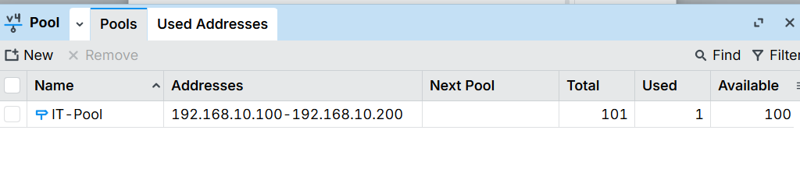
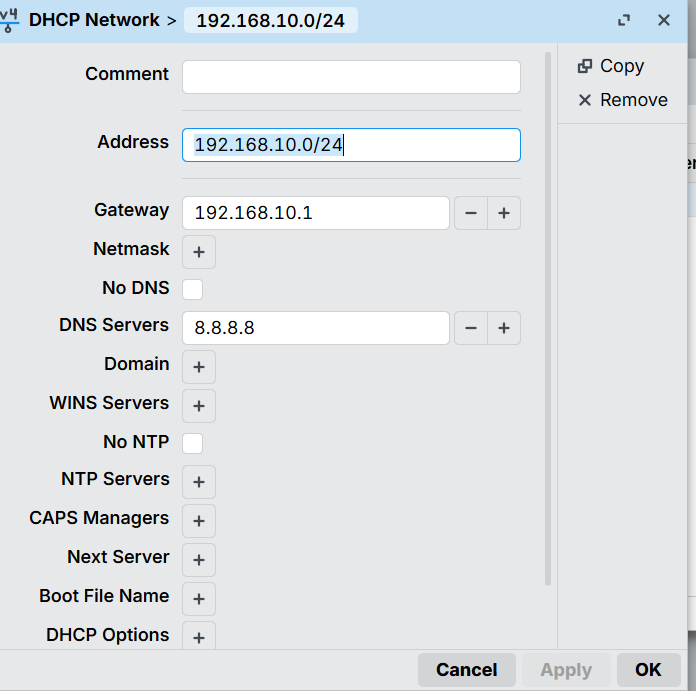
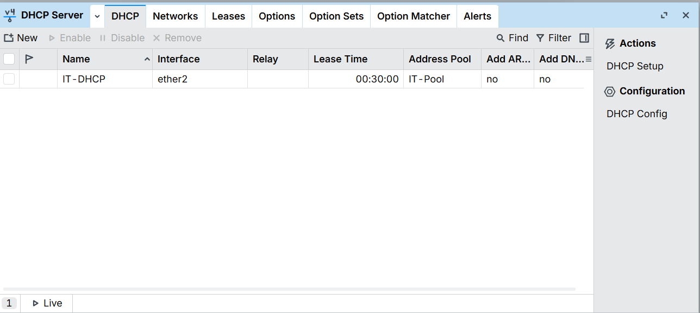
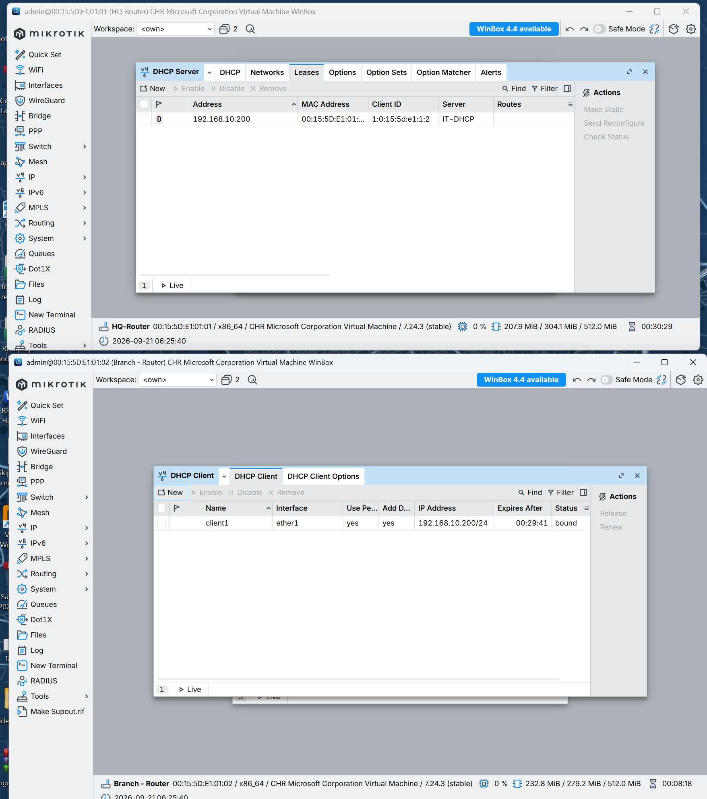
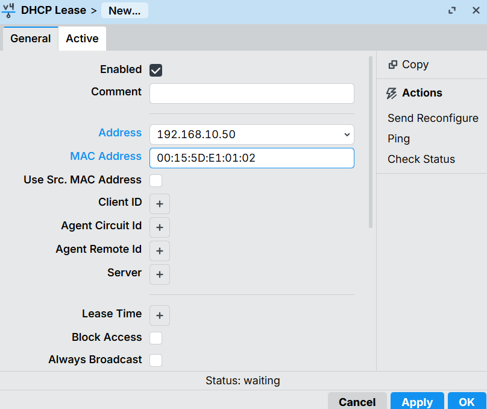
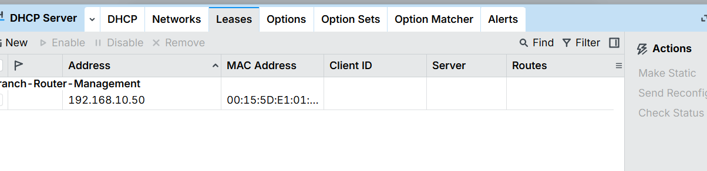

# Module 2 — DHCP

**MTCNA syllabus topics:** DHCP server configuration, address pools, DHCP networks, lease management, DHCP client.

## Why DHCP matters

Without a DHCP server, every workstation on the network needs a manually configured IP address, subnet mask, default gateway, and DNS server. In a network of even 50 devices, this creates:
- Massive manual configuration workload
- High risk of human error (wrong gateway = no internet for that device)
- IP conflicts when two devices are accidentally given the same address
- No central visibility of who has which IP

DHCP solves all of this — one server, automatic assignment, central lease tracking.

## The four things DHCP pushes to every client

1. **IP address** — unique address for that device
2. **Subnet mask** — tells the device which network it belongs to
3. **Default gateway** — where to send traffic destined outside the local network
4. **DNS server** — translates domain names (google.com) to IP addresses

RouterOS can also push additional options (NTP server, domain name, WINS, boot file) but these four are the core MTCNA requirement.

## Three components of a RouterOS DHCP server

| Component | Purpose | Location in Winbox |
|---|---|---|
| **IP Pool** | The range of addresses the server can hand out | IP → Pool |
| **DHCP Network** | Gateway and DNS info pushed to clients | IP → DHCP Server → Networks tab |
| **DHCP Server** | Listens on an interface, ties pool + network together | IP → DHCP Server → DHCP tab |

All three must exist for DHCP to work. Missing any one of them and clients either get no address, or get an address with no gateway/DNS.

## What was configured

**Scope:** IT department subnet (`192.168.10.0/24`) on HQ-Router's `ether2`.

> **Note:** Full per-department DHCP (Finance, HR, Guest) requires VLANs to segment the network first. That's built in Module 3. This module demonstrates the DHCP mechanics on the existing IT subnet — the same steps repeat for each department after Module 3.

### Step 1: Create the address pool

**IP → Pool → +**
- Name: `IT-Pool`
- Addresses: `192.168.10.100-192.168.10.200`

**Why `.100-.200`?** Addresses `.1-.99` are reserved for static assignments — routers, servers, printers, access points. Only `.100` and above are handed out dynamically. This is standard enterprise practice.

The pool shows **Total: 101, Used: 1, Available: 100** — the "Used: 1" reflects a test lease handed to Branch-Router during verification.

### Step 2: Configure the DHCP network

**IP → DHCP Server → Networks tab → +**
- Address: `192.168.10.0/24`
- Gateway: `192.168.10.1`
- DNS Servers: `8.8.8.8`

**Why `192.168.10.1` as gateway?** The gateway must be on the same subnet as the clients — `192.168.10.1` is HQ-Router's LAN IP on that subnet, making it the natural exit point for all client traffic.

### Step 3: Create the DHCP server

**IP → DHCP Server → DHCP tab → +**
- Name: `IT-DHCP`
- Interface: `ether2`
- Address Pool: `IT-Pool`

Lease time defaults to **30 minutes** — suitable for a lab. Production networks typically use 8-24 hours.

## Verification

To test without a dedicated client PC, Branch-Router temporarily ran a DHCP client on `ether1` (which is on the same `192.168.10.0/24` network as HQ-Router's DHCP server).

**Result:** `IT-DHCP` handed out `192.168.10.200/24` — the first available address from IT-Pool — confirmed on both sides simultaneously:

- **HQ-Router (top):** Leases tab shows `192.168.10.200` assigned to Branch-Router's MAC address, served by `IT-DHCP`
- **Branch-Router (bottom):** DHCP Client shows `192.168.10.200/24` bound on `ether1`, lease valid for ~30 minutes

The DHCP client entry was removed from Branch-Router after testing — Branch-Router keeps its static `192.168.10.2/24` as the permanent management address.

## Static DHCP Leases (MAC binding)

A static lease reserves a specific IP address for a specific device based on its MAC address. The device still uses DHCP — it sends a discovery request like any other client — but the server always hands it the same reserved IP rather than picking the next available one from the pool.

**Real-world use cases:**
- Printers — need a predictable IP for print queue configuration
- Servers — need a stable IP without manual static configuration on the device itself
- Network equipment — managed switches, APs, IP cameras

**Configured on HQ-Router:**

**IP → DHCP Server → Leases → +**
- Address: `192.168.10.50`
- MAC Address: `00:15:5D:E1:01:02` (Branch-Router's ether1 — used as a stand-in for a real device)
- Comment: `Branch-Router-Management`

Status shows **waiting** — normal for a static reservation where the device hasn't yet requested a lease. Once that MAC address sends a DHCP discovery, it will always receive `192.168.10.50` regardless of what's currently available in the pool.

**Key difference from dynamic leases:** Static leases never expire and never get handed to another device. Dynamic leases from the pool expire after the lease time and return to the available pool.

---

Once VLANs are built in Module 3, four DHCP servers will be configured on HQ-Router:

| Department | Subnet | Pool Range | Gateway | DHCP Server Name |
|---|---|---|---|---|
| IT | 192.168.10.0/24 | .100-.200 | 192.168.10.1 | IT-DHCP ✅ done |
| Finance | 192.168.20.0/24 | .100-.200 | 192.168.20.1 | Finance-DHCP |
| HR | 192.168.30.0/24 | .100-.200 | 192.168.30.1 | HR-DHCP |
| Guest | 192.168.40.0/24 | .100-.200 | 192.168.40.1 | Guest-DHCP |

## Key lessons

- DHCP requires **three components** — pool, network, and server — all three must be configured
- **Reserve low addresses for static devices** — `.1-.99` for infrastructure, `.100+` for dynamic clients
- The gateway pushed by DHCP must be on the **same subnet** as the clients
- RouterOS's **Leases tab** gives real-time visibility of every device that has an IP — a powerful network management tool
- A **30-minute lease** means if a device leaves the network, its IP returns to the pool in 30 minutes — shorter leases suit dynamic environments (guest WiFi), longer leases suit stable office networks

---

*[← Back to README](../README.md)*
