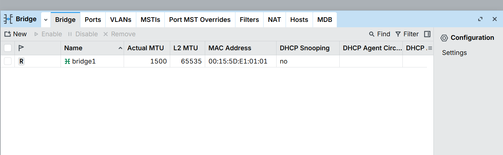
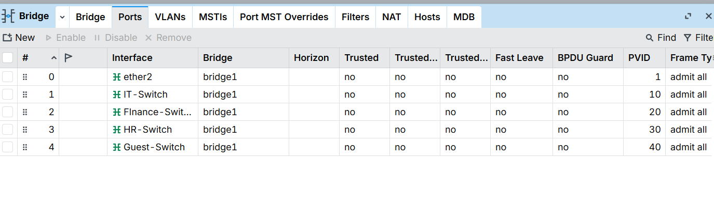
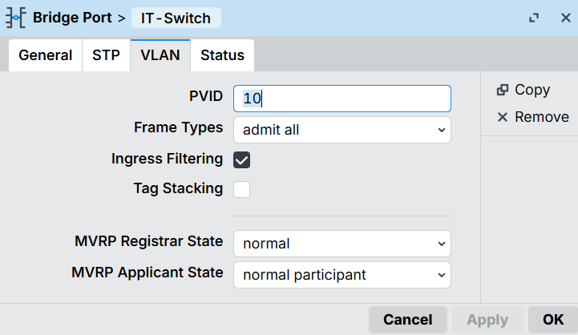
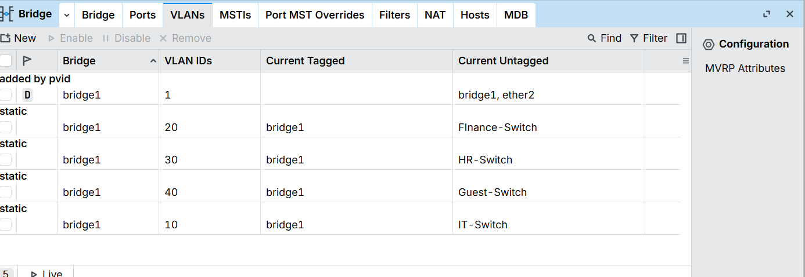
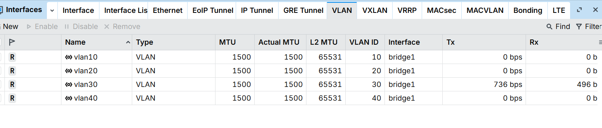
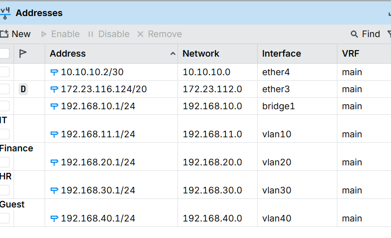
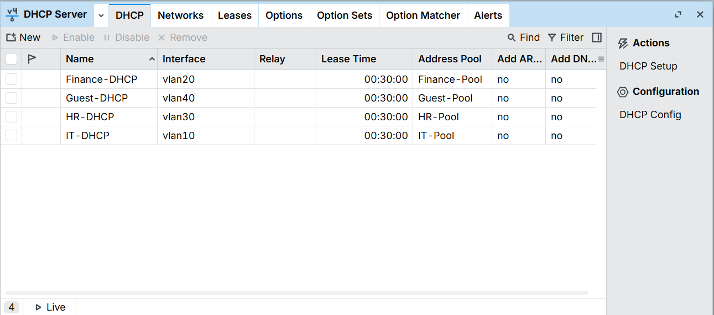
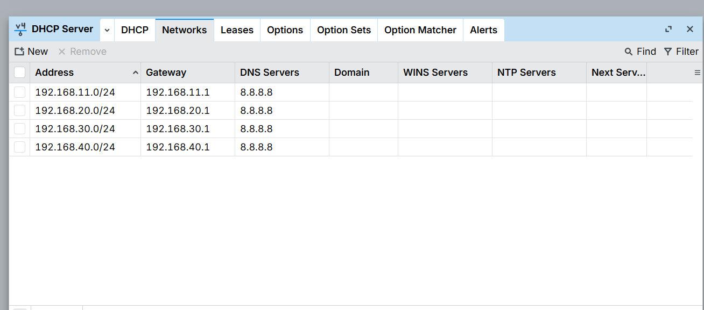
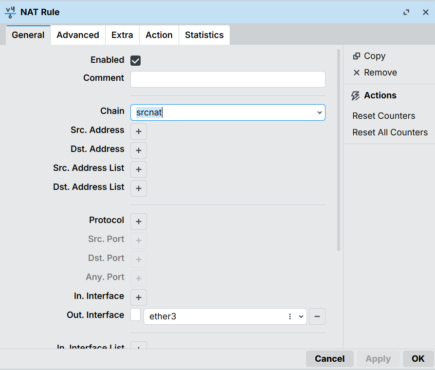
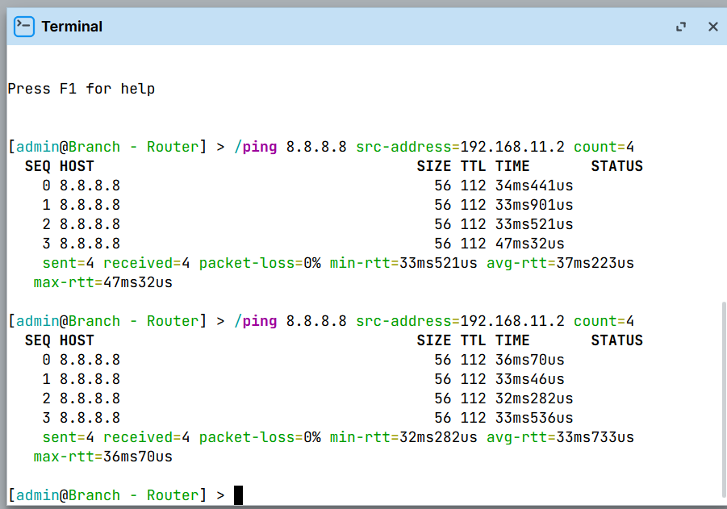

# Module 3 — Bridging & VLANs

**MTCNA syllabus topics:** Bridge creation, bridge ports, VLAN filtering, VLAN interfaces, inter-VLAN routing, DHCP per VLAN.

## Why bridging and VLANs are needed

In our enterprise network, HQ-Router needs to serve four separate department networks — IT, Finance, HR, and Guest. The problem: HQ-Router only has one physical interface facing the internal network (`ether2`). 

**The solution:** VLANs — dividing one physical network into multiple isolated logical networks. But in RouterOS, VLAN filtering only works on a **bridge interface**, not on plain physical interfaces. So the workflow is always:

1. Create a bridge (virtual managed switch)
2. Add physical ports to it
3. Enable VLAN filtering
4. Create VLAN interfaces on top

## Real-world vs lab comparison

| Scenario | Layer 2 | Layer 3 |
|---|---|---|
| Real office with managed switch | Physical managed switch handles VLANs | MikroTik router does inter-VLAN routing via VLAN interfaces |
| Our virtual lab | RouterOS bridge simulates the managed switch | Same RouterOS router does inter-VLAN routing |

In a real deployment, a physical managed switch would handle the VLAN separation — the router would only need VLAN sub-interfaces, no bridge required. The bridge in our lab is a workaround for having no physical managed switch.

## Key concepts

**Bridge = virtual managed switch**
Combining interfaces into a bridge makes them behave like ports on a switch — traffic flows at Layer 2 based on MAC addresses, not IP addresses.

**Why the IP must move to bridge1 before adding ether2**
When ether2 joins the bridge it becomes a dumb port — switch ports don't have IP addresses. Moving `192.168.10.1/24` to bridge1 first keeps Winbox management access alive throughout the process. Bridge1 acts as the switch's CPU/management interface.

**VLAN filtering = the walls between departments**
Without it, bridge1 is a dumb switch — all traffic flows freely between all ports. With VLAN filtering ON, the bridge enforces isolation — each department's traffic stays in its own VLAN.

**PVID (Port VLAN ID) = automatic VLAN stamping**
When an untagged frame (from a PC that doesn't know about VLANs) arrives on a bridge port, the bridge stamps it with that port's PVID. IT-Switch has PVID 10 → all frames get tagged VLAN 10 automatically.

**Tagged vs Untagged**
- **Untagged:** client PCs send plain frames — they don't know about VLANs. The bridge assigns them to a VLAN based on the port's PVID
- **Tagged:** the router side (bridge1) receives tagged frames — it needs to know which VLAN each frame belongs to for routing

**VLAN interfaces = department gateways**
Virtual interfaces (vlan10, vlan20, vlan30, vlan40) sit on top of bridge1. Each gets its own IP address — that IP becomes the gateway for that department.

## Final topology built

```
HQ-Router
├── ether2 (bridge port, PVID 1) → management network 192.168.10.0/24
├── IT-Switch (bridge port, PVID 10) → IT department
├── Finance-Switch (bridge port, PVID 20) → Finance department
├── HR-Switch (bridge port, PVID 30) → HR department
├── Guest-Switch (bridge port, PVID 40) → Guest department
│
└── bridge1 (virtual managed switch, VLAN filtering ON)
    ├── vlan10 → 192.168.11.1/24 (IT gateway)
    ├── vlan20 → 192.168.20.1/24 (Finance gateway)
    ├── vlan30 → 192.168.30.1/24 (HR gateway)
    └── vlan40 → 192.168.40.1/24 (Guest gateway)
```

## Step-by-step configuration

### Phase 1 — Create the bridge

**Bridge → + (New)** → Name: `bridge1` → OK



### Phase 2 — Add ether2 as a bridge port and move the management IP

First add `192.168.10.1/24` to bridge1, then remove it from ether2, then add ether2 as a port:

- **IP → Addresses → +** → `192.168.10.1/24` on `bridge1`
- **IP → Addresses** → remove `192.168.10.1/24` from `ether2`
- **Bridge → Ports tab → +** → Interface: `ether2`, Bridge: `bridge1`

### Phase 3 — Enable VLAN filtering

**Bridge → Bridge tab → double-click bridge1 → VLAN tab → tick VLAN Filtering → Apply → OK**

Note: Winbox may briefly disconnect when VLAN filtering is enabled. Reconnect via MAC address from the Neighbors tab if needed. VLAN 1 is automatically created for management traffic (bridge1 and ether2 untagged).

### Phase 4 — Add department switches as bridge ports

Four new Hyper-V Internal switches were created (IT-Switch, Finance-Switch, HR-Switch, Guest-Switch) and four new network adapters added to HQ-Router — one per department switch.

**Bridge → Ports tab → +** four times, each with PVID set on the VLAN tab:



| Port | PVID | Department |
|---|---|---|
| ether2 | 1 | Management |
| IT-Switch | 10 | IT |
| Finance-Switch | 20 | Finance |
| HR-Switch | 30 | HR |
| Guest-Switch | 40 | Guest |



### Phase 5 — Configure VLANs on the bridge

**Bridge → VLANs tab** — four department VLANs added:

| VLAN ID | Tagged | Untagged | Purpose |
|---|---|---|---|
| 1 | — | bridge1, ether2 | Management (auto-created) |
| 10 | bridge1 | IT-Switch | IT department |
| 20 | bridge1 | Finance-Switch | Finance department |
| 30 | bridge1 | HR-Switch | HR department |
| 40 | bridge1 | Guest-Switch | Guest department |



### Phase 6 — Create VLAN interfaces

**Interfaces → + → VLAN** four times, all on bridge1:



### Phase 7 — Assign department gateway IPs

**IP → Addresses → +** four times:



| Interface | IP Address | Department |
|---|---|---|
| vlan10 | 192.168.11.1/24 | IT |
| vlan20 | 192.168.20.1/24 | Finance |
| vlan30 | 192.168.30.1/24 | HR |
| vlan40 | 192.168.40.1/24 | Guest |

### Phase 8 — DHCP servers for all departments

**IP → Pool** — four pools created, **IP → DHCP Server → Networks** — four networks, **IP → DHCP Server → DHCP** — four servers:





| Department | Pool Range | Gateway | Server Name |
|---|---|---|---|
| IT | 192.168.11.100-.200 | 192.168.11.1 | IT-DHCP |
| Finance | 192.168.20.100-.200 | 192.168.20.1 | Finance-DHCP |
| HR | 192.168.30.100-.200 | 192.168.30.1 | HR-DHCP |
| Guest | 192.168.40.100-.200 | 192.168.40.1 | Guest-DHCP |

### Phase 9 — NAT masquerade for internet access

**IP → Firewall → NAT → +** → Chain: `srcnat`, Out. Interface: `ether3`, Action: `masquerade`



## Verification

Branch-Router was temporarily connected to IT-Switch with IP `192.168.11.2/24`. Ping test confirmed full end-to-end connectivity:



- Ping to `192.168.11.1` (HQ-Router IT gateway) ✅
- Ping to `8.8.8.8` (internet via NAT) ✅ — 4/4 packets, 0% loss, ~34ms

## Lab limitation noted

Client VMs (Alpine Linux, TinyCore) had connectivity issues due to **Hyper-V MAC address learning limitations** with RouterOS bridges. The bridge correctly forwarded traffic (confirmed via Torch tool showing DHCP discovery packets reaching vlan10) but client VMs couldn't complete the DHCP handshake reliably in RAM-only mode.

**Workaround used:** Branch-Router (a full RouterOS instance) connected to IT-Switch as a test client — confirmed the VLAN and routing configuration is correct. In a real deployment with a physical managed switch, client PCs would connect normally without this limitation.

## Key lessons

- RouterOS bridge is needed because **VLAN filtering only works on a bridge**, not plain interfaces
- Always **move the management IP to bridge1 before** adding the physical interface as a bridge port — otherwise Winbox disconnects
- **PVID** determines which VLAN untagged frames get assigned to — one PVID per port
- **Tagged on bridge1, Untagged on physical ports** — router side needs tags, client devices don't
- VLAN interfaces (vlan10, vlan20 etc.) sitting on bridge1 are what enable inter-VLAN routing — each one acts as the gateway for its department
- **NAT masquerade must be on the WAN interface (ether3)**, not on bridge ports or VLAN interfaces

---

*[← Back to README](../README.md)*
